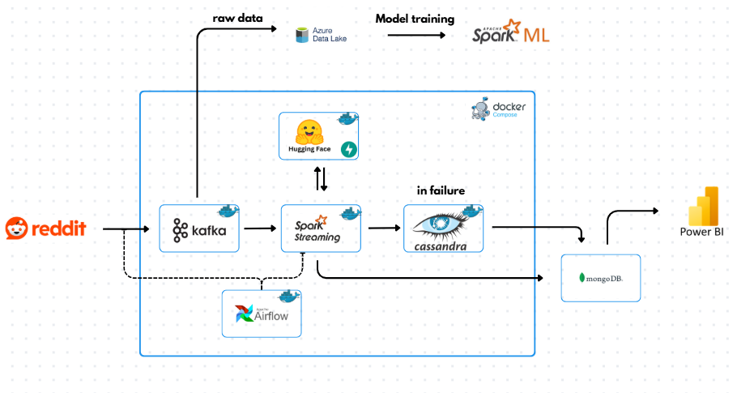
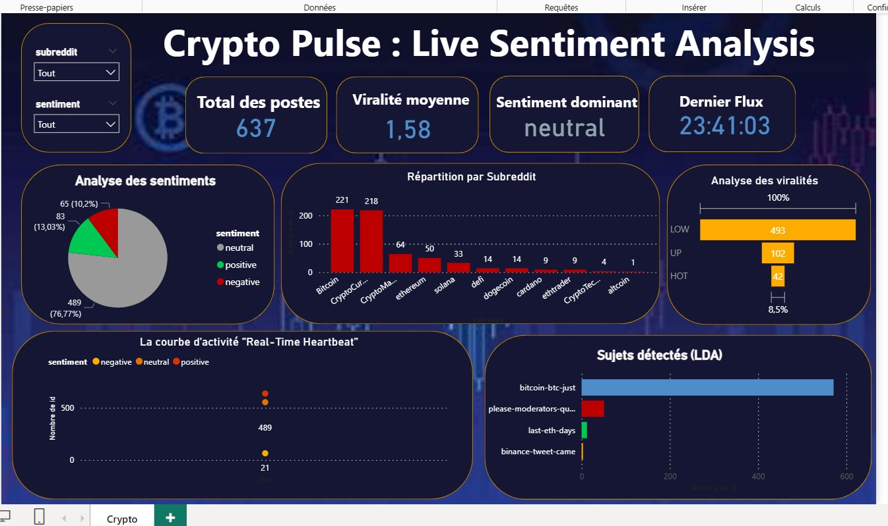

# 🚀 Reddit Real-Time Sentiment & Virality Pipeline

An end-to-end Big Data engineering project that ingests financial discussions from Reddit, processes them in real-time using Spark Streaming and Machine Learning, and stores the results for visualization.

This architecture features a hybrid storage solution (Data Lake, NoSQL) and a robust fallback mechanism ensuring zero data loss during the streaming process.

---

## 🏗 Architecture Diagram

*The pipeline orchestrates data flow from Reddit to storage layers, managed by Docker Compose.*

---

## 📖 Project Overview

This pipeline is designed to detect viral financial trends on Reddit (e.g., r/Bitcoin, r/CryptoCurrency) in real-time. It performs the following operations:

1.  **Ingestion:** Fetches live data via Reddit API and pushes it to **Kafka**. Simultaneously archives raw data to **Azure Data Lake**.
2.  **Training (Offline):** Machine Learning models are trained locally using historical data from the Data Lake.
3.  **Inference (Streaming):**
    * **Spark Structured Streaming** consumes Kafka topics.
    * **NLP/Sentiment Analysis:** Calls a dedicated **FastAPI** microservice (DistilRoBERTa).
    * **Topic Modeling:** Identifies subjects dynamically using LDA.
    * **Virality Prediction:** Uses Random Forest to predict if a post will become "HOT".
4.  **Storage:**
    * **Primary Storage:** **MongoDB** (Running on Host Machine).
        * *Status:* Active Default.
    * **Fallback Storage:** **Apache Cassandra** (Docker Container).
        * *Status:* Failover (Triggered automatically if MongoDB is unreachable).

> **⚠️ Architectural Note:**
> We acknowledge that **Apache Cassandra** is the industry standard for high-throughput write-heavy workloads and is theoretically better optimized for this pipeline's analytics.
>
> However, due to hardware resource limitations in the local development environment, running a full Cassandra node within a Docker container causes significant system blocking. Consequently, **MongoDB** (running natively on the host machine) is utilized as the primary storage to ensure smooth performance, while Cassandra is retained in the architecture to demonstrate the implementation of a **fault-tolerance mechanism**.

5.  **Orchestration:** Apache Airflow manages the workflow.
6.  **Visualization:** PowerBI connected to the database.

---

## 🛠 Tech Stack

### Infrastructure & Orchestration
* **Docker & Docker Compose:** Full containerization.
* **Apache Airflow:** Workflow orchestration (DAGs).
* **Apache Kafka:** Event streaming and ingestion.

### Processing & Machine Learning
* **Apache Spark (PySpark):** Structured Streaming, SparkML.
* **FastAPI:** Microservice for the Transformer model.
* **HuggingFace:** `mrm8488/distilroberta-finetuned-financial-news-sentiment-analysis`.
* **Spark ML:** Random Forest, LDA, Word2Vec, CountVectorizer.

### Storage
* **Azure Data Lake Gen2:** Raw storage / Archiving.
* **Apache Cassandra:** Optimized for write-heavy streaming data (Fallback mechanism).
* **MongoDB:** Document store.

---

## 📂 Docker Services

The infrastructure is defined in `docker-compose.yml`:

| Service Name | Description | Port (Host) |
| :--- | :--- | :--- |
| **broker** | Kafka Message Broker | 9092 / 9093 |
| **spark-master** | Spark Master Node | 8080 (UI) / 7077 |
| **spark-worker** | Spark Worker Node | 8081 |
| **sentiment-api** | Python FastAPI (Inference) | 8000 |
| **cassandra** | NoSQL Database | 9042 |
| **airflow-webserver** | Airflow UI | 8091 |
| **airflow-scheduler** | Airflow Scheduler | - |

---

## ⚙️ Key Features & Logic

### 1. Sentiment Analysis Microservice (`sentiment-api`)
To avoid heavy deep learning computations inside the JVM/Spark, we use a separate Python container running FastAPI.
* **Model:** Financial News Sentiment Analysis (DistilRoBERTa).
* **Input:** List of text strings.
* **Output:** Sentiment labels.

### 2. The Inference Engine (`RedditInferenceEngine`)
Running on Spark, this engine handles the complexity:
* **Dynamic Topic Naming:** It maps LDA mathematical vectors to human-readable topics (e.g., "wallet-key-lost") using a custom UDF.
* **Virality Scoring:** Predicts a score and assigns a category:
    * 🔥 **HOT** (Score > 5)
    * 📈 **UP** (Score > 2)
    * 💤 **LOW** (Else)
* **Fault Tolerance:** Implements a `try-catch` block. If writing to Cassandra fails, the batch is automatically redirected and saved to MongoDB to prevent data loss.

---

## 📈 Visualization

Data processed by Spark is visualized in PowerBI to track sentiment trends and topic virality.

---

## 📊 Monitoring

You can monitor the health and status of the pipeline using the following interfaces:

* **Spark Master UI:** [http://localhost:8080](http://localhost:8080)
    * *Use this to monitor active streaming queries, worker status, and memory usage.*
* **Airflow UI:** [http://localhost:8091](http://localhost:8091)
    * *Use this to view logs, retry failed tasks, and monitor pipeline execution time.*
* **FastAPI Documentation:** [http://localhost:8000/docs](http://localhost:8000/docs)
    * *Use this to test the sentiment analysis model manually with custom text inputs.*

---

## 👥 Authors

This project was jointly designed and developed by:

* **[EL RHERBI Mohamed Amine]** - [GitHub Profile](https://github.com/medamineelrherbi)
* **[CHATRAOUI Hamza]** -   [GitHub Profile](https://github.com/chatraouihamza)
* **[DHAH Chaimaa]** -   [GitHub Profile](https://github.com/ChaimaaDhah)
* **[EL Houdaigui Maria]** -  [GitHub Profile](https://github.com/mariaelhoudaigui)
* **[AMMAM Yassir]** - [GitHub Profile](https://github.com/chatraouihamza)

*We built this entire pipeline together from scratch.*

## 📝 License

This project is open-source and available under the [MIT License](https://opensource.org/licenses/MIT).